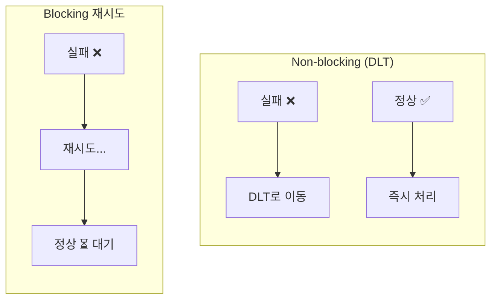
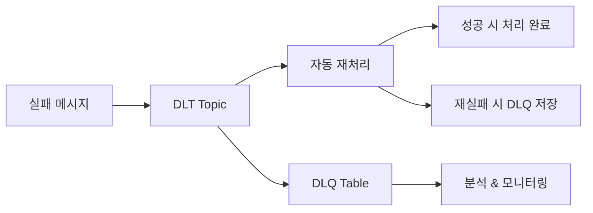

## Dead Letter Topic이란?

분산 시스템에서 메시지 처리 실패는 흔한 일이다. 일시적인 네트워크 지연, 외부 API 오류, 데이터 형식 불일치 등 다양한 이유로 실패가 발생한다. 이러한 실패를 효과적으로 관리하기 위해 Dead Letter Topic(DLT)과 재시도 전략이 필요하다.

DLT는 재시도에도 불구하고 처리에 실패한 메시지를 저장하는 Kafka 토픽이다. '마지막 피난처'로서 다음 역할을 수행한다.

- 처리 실패 메시지의 안전한 격리
- 실패 원인 분석 및 디버깅
- 메인 스트림 처리 흐름 유지 (Non-blocking)

---

## 왜 Non-blocking 재시도인가

실패한 메시지를 같은 Consumer에서 바로 재시도하면 **Head-of-line blocking**이 발생한다. 앞의 실패 메시지가 해결될 때까지 뒤의 정상 메시지들이 대기해야 한다.



| 방식 | 오프셋 진행 | 뒤 메시지 처리 | 처리량 |
|------|------------|---------------|--------|
| Blocking | 실패 시 멈춤 | 대기 | 저하 |
| Non-blocking (DLT) | 계속 진행 | 즉시 처리 | 유지 |

DLT는 실패 메시지를 별도 토픽으로 격리하여 메인 Consumer가 다음 메시지를 즉시 처리하게 한다.

> "Non-blocking request reprocessing... without blocking real-time traffic"
> — [Uber Engineering](https://www.uber.com/blog/reliable-reprocessing/)

---

## @RetryableTopic으로 재시도 구현

Spring Kafka 2.7.0부터 `@RetryableTopic` 어노테이션으로 non-blocking 재시도를 선언적으로 구현할 수 있다. [Spring Kafka 공식 문서](https://docs.spring.io/spring-kafka/reference/retrytopic/dlt-strategies.html)에서 상세 설정을 확인할 수 있다.

### 기본 구현

```kotlin
@RetryableTopic(
    attempts = "5",
    backoff = Backoff(delay = 5000, multiplier = 2.0),
    dltStrategy = DltStrategy.FAIL_ON_ERROR,
    dltTopicSuffix = ".dlt",
    retryTopicSuffix = ".retry",
    exclude = [NonRetryableException::class]
)
@KafkaListener(
    topics = ["order.created"],
    groupId = "order-service",
    containerFactory = "kafkaListenerContainerFactory"
)
fun consume(record: ConsumerRecord<String, String>) {
    try {
        val order = objectMapper.readValue(record.value(), Order::class.java)
        orderService.process(order)
    } catch (e: RetryableException) {
        log.error("Retryable error: ${e.message}")
        throw e  // 재시도 대상
    } catch (e: NonRetryableException) {
        log.error("Non-retryable error: ${e.message}")
        throw e  // 즉시 DLT로 이동
    }
}
```

### 주요 설정 옵션

| 옵션 | 설명 |
|------|------|
| `attempts` | 최대 시도 횟수 (첫 시도 포함) |
| `backoff.delay` | 재시도 간 대기 시간 (ms) |
| `backoff.multiplier` | 대기 시간 증가율 |
| `dltStrategy` | DLT 처리 실패 시 동작 |
| `exclude` | 재시도하지 않을 예외 클래스 |

### 재시도 흐름

`attempts = 5`, `delay = 5000`, `multiplier = 2.0` 설정 시 흐름은 다음과 같다.

```
1차 시도 → 실패 → order.created.retry-0 (5초 후)
2차 시도 → 실패 → order.created.retry-1 (10초 후)
3차 시도 → 실패 → order.created.retry-2 (20초 후)
4차 시도 → 실패 → order.created.retry-3 (40초 후)
5차 시도 → 실패 → order.created.dlt
```

---

## DLT + DLQ 이중 구조

실무에서는 **DLT(재처리용)**와 **DLQ(분석용)** 이중 구조가 효과적이다. 각각의 역할을 명확히 분리하여 운영한다.



**DLT와 DLQ 역할**

- **DLT (Topic)**: 일시적 저장, Spring Kafka가 자동 관리
- **DLQ (DB)**: 영구 저장, SQL로 분석 및 모니터링

### @DltHandler 구현

DLT 메시지를 DLQ에 저장하고, 실패 시 즉시 알림을 발송한다.

```kotlin
@DltHandler
fun processDltMessage(
    record: ConsumerRecord<String, String>,
    @Header(KafkaHeaders.EXCEPTION_MESSAGE) errorMessage: String
) {
    try {
        // 1. DLQ에 저장 시도
        dlqService.save(record, errorMessage)
        log.info("DLQ에 저장 완료: ${record.key()}")
        
    } catch (e: Exception) {
        // 2. DB 저장 실패 시 즉시 알림
        slackService.sendCriticalAlert(
            title = "🚨 DLQ 저장 실패",
            message = """
                Topic: ${record.topic()}
                Key: ${record.key()}
                Message: ${record.value()}
                Error: ${e.message}
            """.trimIndent()
        )
        
        // 3. 로그에도 기록
        log.error("DLQ save failed for message: ${record.value()}", e)
    }
}
```


---

## 참고 자료

- [Spring Kafka - DLT Strategies](https://docs.spring.io/spring-kafka/reference/retrytopic/dlt-strategies.html)
- [Uber - Building Reliable Reprocessing and Dead Letter Queues with Kafka](https://www.uber.com/blog/reliable-reprocessing/)
- [Baeldung - Dead Letter Queue for Kafka With Spring](https://www.baeldung.com/kafka-spring-dead-letter-queue)
- [Baeldung - Implementing Retry in Kafka Consumer](https://www.baeldung.com/spring-retry-kafka-consumer)
- [Spring Kafka Non-Blocking Retries and Dead Letter Topics](https://github.com/eugene-khyst/spring-kafka-non-blocking-retries-and-dlt)
