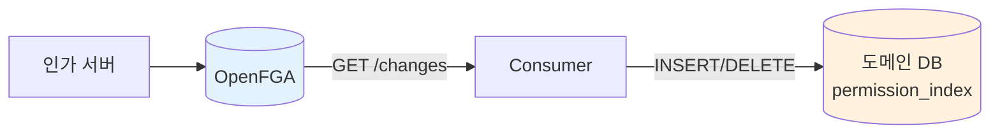
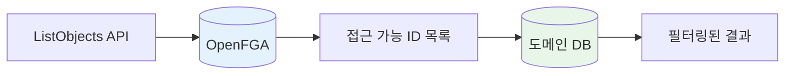
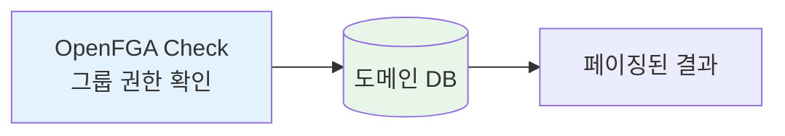

## 권한 기반 검색이란

"사용자가 접근 가능한 리소스 목록"을 조회하는 것은 권한 시스템의 핵심 기능이다.

```
예: alice가 볼 수 있는 차량 목록은?
→ [vehicle:v1, vehicle:v2, vehicle:v3, ...]
```

OpenFGA 공식 문서 [Search with Permissions](https://openfga.dev/docs/interacting/search-with-permissions)에서는 이를 구현하는 **3가지 옵션**을 제시한다.

---

## Option 1: Search, then Check

DB에서 먼저 검색하고, 결과에 대해 권한을 검증한다.


```kotlin
fun searchVehicles(query: String, pageable: Pageable): Page<Vehicle> {
    // 1. DB에서 검색
    val candidates = vehicleRepository.search(query, pageable)

    // 2. 권한 일괄 검증
    val checks = candidates.map {
        CheckRequest(user = currentUser, relation = "viewer", object = "vehicle:${it.id}")
    }
    val results = openFgaClient.batchCheck(checks)

    // 3. 권한 있는 것만 반환
    return candidates.filterIndexed { i, _ -> results[i].allowed }
}
```

**적합한 상황**: 검색 결과가 적거나, 대부분 권한이 있는 경우

**주의점**: 권한 없는 객체가 많으면 빈 페이지가 반환될 수 있음

---

## Option 2: Build a Local Index

권한 데이터를 도메인 DB에 동기화하고, 검색 시 JOIN으로 활용한다.

인가 서버와 도메인 서버가 분리된 환경에서는 별도 동기화가 필요하다.

**동기화 방식**



| 방식 | 구현 | 지연 |
|------|------|------|
| Polling | Consumer가 주기적으로 GET /changes 호출 | 수 초 |
| 메시지 큐 | 인가 서버 → Kafka/SQS → 도메인 서버 | 실시간 |

```kotlin
// Consumer 서비스 (별도 프로세스)
@Scheduled(fixedRate = 5000)
fun syncPermissions() {
    val changes = openFgaClient.getChanges(continuationToken)
    changes.forEach { change ->
        val tuple = change.tupleKey  // user:alice, viewer, vehicle:v1
        when (change.operation) {
            WRITE -> jdbcTemplate.update(
                "INSERT INTO permission_index (user_id, resource_id) VALUES (?, ?)",
                tuple.user, tuple.object
            )
            DELETE -> jdbcTemplate.update(
                "DELETE FROM permission_index WHERE user_id = ? AND resource_id = ?",
                tuple.user, tuple.object
            )
        }
    }
}
```

**목록 조회 시**


```kotlin
// 도메인 서버
fun searchVehicles(userId: UUID, query: String, pageable: Pageable): Page<Vehicle> {
    return vehicleRepository.searchWithPermission(userId, query, pageable)
}

// Repository
@Query("""
    SELECT v.* FROM vehicles v
    JOIN permission_index p ON v.id = p.resource_id
    WHERE p.user_id = :userId AND v.name LIKE :query
""")
fun searchWithPermission(userId: UUID, query: String, pageable: Pageable): Page<Vehicle>
```

**적합한 상황**: 접근 가능한 객체가 많지만, 전체 대비 비율이 낮은 경우 (예: Google Drive)

**trade-off**: 별도 인덱스 테이블 관리, 동기화 지연 가능성

---

## Option 3: ListObjects, then Search

ListObjects API로 접근 가능한 ID 목록을 먼저 가져온다.



```kotlin
fun getAccessibleVehicles(userId: UUID, pageable: Pageable): Page<Vehicle> {
    // 1. 접근 가능한 ID 목록 조회
    val vehicleIds = openFgaClient.listObjects(
        user = "user:$userId",
        relation = "viewer",
        type = "vehicle"
    )

    // 2. 해당 ID로 DB 검색
    return vehicleRepository.findByIdIn(vehicleIds, pageable)
}
```

**적합한 상황**: 접근 가능한 객체가 적은 경우 (~1,000개 이하)

**제약사항**:
- 기본 최대 1,000개까지만 반환한다
- 페이지네이션을 지원하지 않는다
- 정렬이나 필터링이 불가능하다

---

## 상황별 선택 가이드

OpenFGA 공식 문서의 권장 사항:

| 상황 | 추천 옵션 |
|------|---------|
| 검색 결과가 적음 | Option 1 |
| 접근 가능 객체 적음 (~1,000개) | Option 3 |
| 접근 가능 객체 많음, 전체 대비 비율 낮음 | Option 2 |
| 접근 가능 객체 많음, 전체 대비 비율 높음 | Option 1 또는 2 |

그런데 여기서 한 가지 질문이 생긴다.

**"접근 가능한 객체가 많고, 전체 대비 비율도 높다면?"**

예를 들어 Tesla 직원이 Tesla 차량 10,000대 **전체**에 접근 가능한 경우다. 이런 상황에서는 **그룹 기반 권한 설계**로 더 단순하게 풀 수 있다.

---

## 그룹 기반 UX로 단순화하기

실제 서비스에서 권한 관리 화면을 보면, 대부분 **그룹 단위**로 설계되어 있다.

### B2C 고객: 내 차량만

```
┌─────────────────────────────────┐
│ 🚗 내 차량                       │
│                                  │
│ ┌─────────┐  ┌─────────┐        │
│ │ Model 3  │  │ Model Y  │        │
│ │ 서울 12가 │  │ 경기 34나 │        │
│ └─────────┘  └─────────┘        │
└─────────────────────────────────┘
```

본인 차량 1~3대만 조회. 어떤 옵션을 써도 성능 문제 없음.

### B2B 운영자: 그룹 단위로

```
┌─────────────────────────────────┐
│ 📊 차량 관리 (Tesla 관리자)       │
│                                  │
│ [그룹 선택] ▼ 전체 차량           │
│ ├─ 전체 차량 (10,000대)          │
│ ├─ 서울 지역 (3,200대)           │
│ ├─ 부산 지역 (1,800대)           │
│ └─ 테스트 차량 (50대)            │
│                                  │
│ 차량 목록:                        │
│ │ Model 3 | 서울 12가 | 정상    │
│ │ Model Y | 서울 34나 | 정상    │
│ │ ...                          │
│              [1] [2] [3] ... [500]│
└─────────────────────────────────┘
```

그룹 드롭다운에서 선택 → 해당 그룹 차량 조회. **개별 차량을 선택하는 UI는 없다.**

### 권한 관리 UI도 그룹 단위

```
┌─────────────────────────────────┐
│ 👤 사용자 권한 설정               │
│                                  │
│ 사용자: operator@tesla.com       │
│                                  │
│ 차량 그룹 접근 권한:              │
│ ☑ 전체 차량                      │
│ ☐ 서울 지역                      │
│ ☐ 부산 지역                      │
└─────────────────────────────────┘
```

10,000대 차량을 체크박스로 선택하는 UI는 없다. **UX가 그룹 단위면, 권한 데이터도 그룹 단위가 된다.**

---

## 그룹 기반 권한의 구현

그룹 권한이면 **Option 1의 변형**으로 단순하게 구현된다.



```kotlin
fun getVehiclesByGroup(companyCode: String, groupId: String, pageable: Pageable): Page<Vehicle> {
    // 1. 그룹 권한 체크 (Check 1회)
    val hasAccess = openFgaClient.check(
        user = "company:$companyCode",
        relation = "viewer",
        object = "vehicle_group:$groupId"
    )

    if (!hasAccess) throw ForbiddenException()

    // 2. DB에서 바로 페이징
    return vehicleRepository.findByGroup(groupId, pageable)
}
```

**ListObjects 호출 없이**, Check 1회 + SQL 페이징으로 끝난다.

도메인 DB에 이미 그룹-리소스 매핑이 있기 때문이다:

```sql
vehicles (id, name, group_id, company_id, ...)
vehicle_groups (id, name, company_id, ...)
```

---

## 정리

OpenFGA에서 권한 기반 검색을 구현하는 방법:

| 옵션 | 방식 | 적합한 상황 |
|------|------|------------|
| Option 1 | Search, then Check | 검색 결과가 적거나 대부분 권한 있음 |
| Option 2 | Local Index | 접근 가능 객체 많고 전체 대비 비율 낮음 |
| Option 3 | ListObjects | 접근 가능 객체 적음 (~1,000개) |
| **그룹 기반** | Check + DB 페이징 | 그룹 단위 권한 관리 |

어떤 옵션을 선택할지는 **권한 관리 UX가 어떤 데이터 구조를 만들어내는지**에 달려 있다.

그룹 기반 UX가 가능한 상황이라면, 별도 인덱스 구축 없이 도메인 DB만으로 단순하게 구현할 수 있다.

---

## 참고 자료

- [OpenFGA - Search with Permissions](https://openfga.dev/docs/interacting/search-with-permissions) - 공식 가이드
- [OpenFGA - Relationship Queries](https://openfga.dev/docs/interacting/relationship-queries)
- [OpenFGA - Parent-Child Pattern](https://openfga.dev/docs/modeling/parent-child)
- [Google Zanzibar Paper](https://research.google/pubs/pub48190/)
