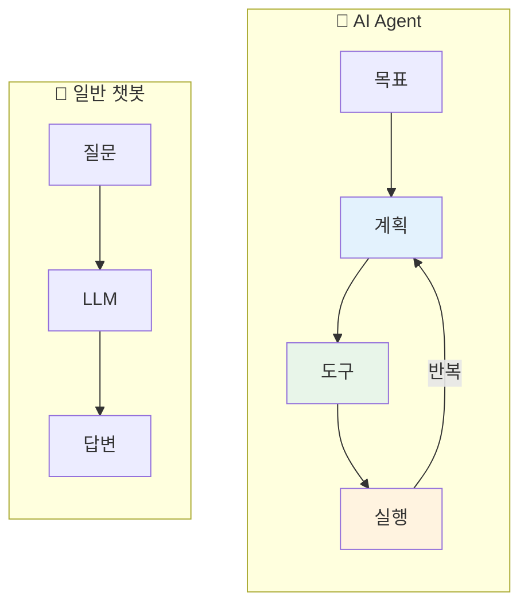
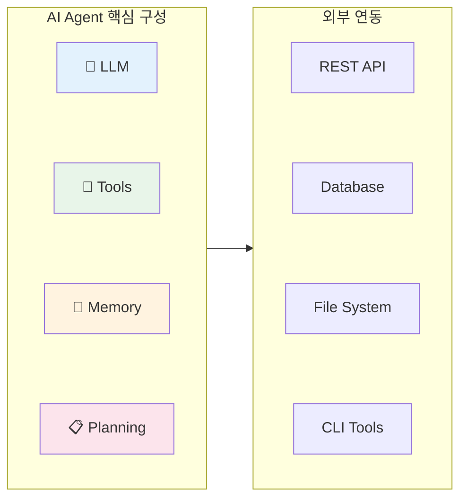
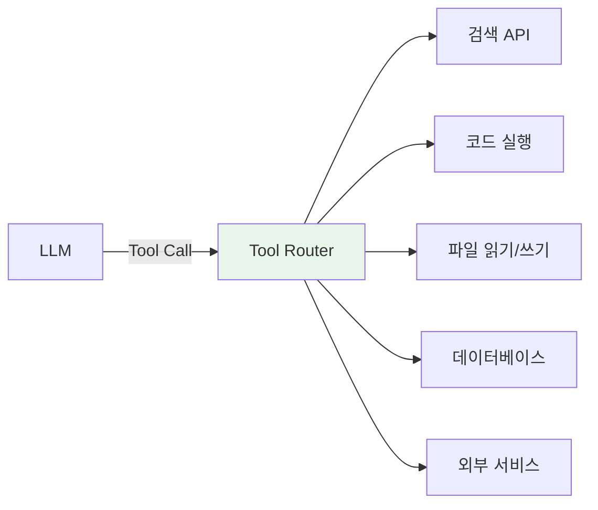
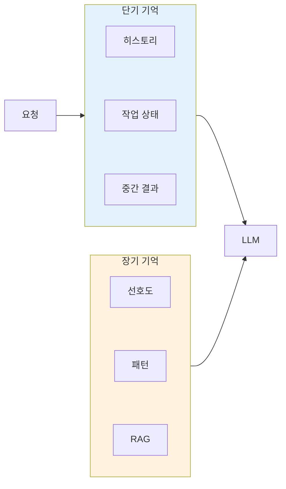
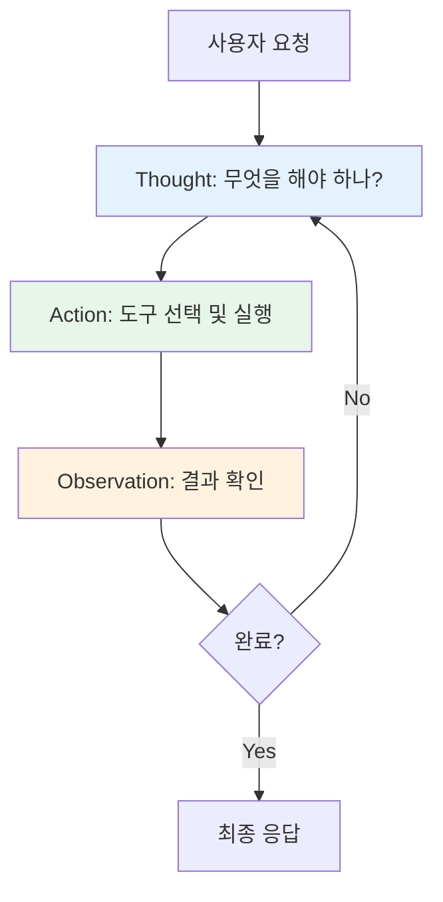
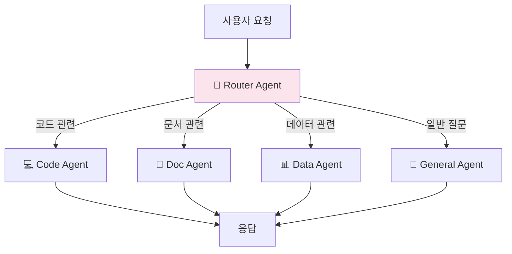
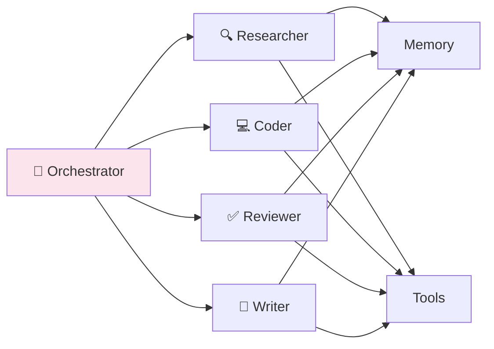
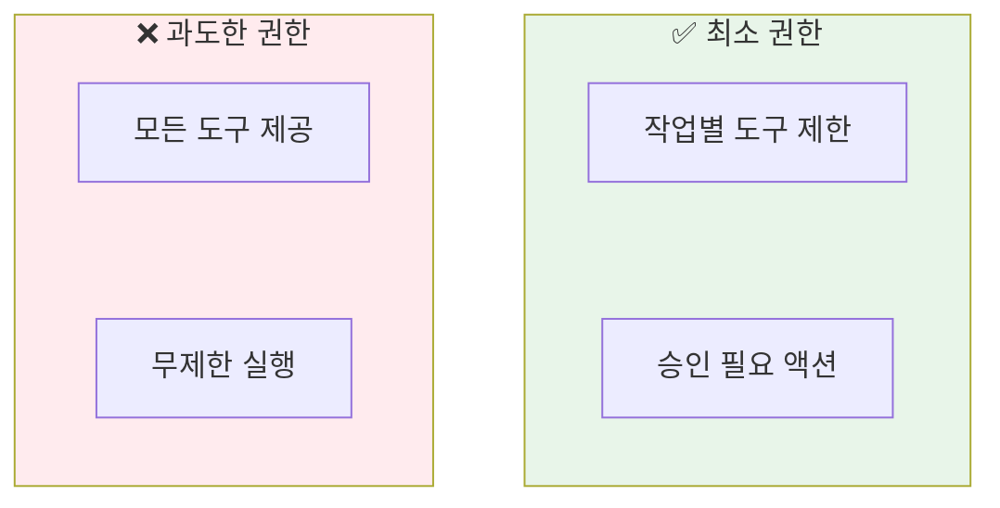
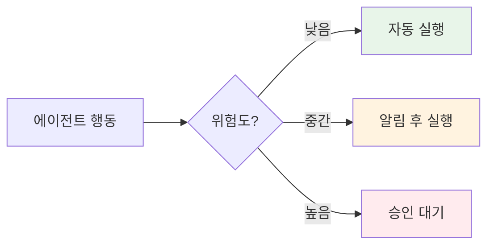

> 이 글은 AI Agent의 기초 개념을 다룬다. 실제 구현 사례는 [Claude Flow 시리즈](/dev-notes/posts/2025-11-22-claude-flow-development-story/)에서 확인할 수 있다.

## AI Agent란 무엇인가

AI Agent는 **목표를 달성하기 위해 자율적으로 행동하는 AI 시스템**이다. 단순히 질문에 답하는 챗봇과 달리, 에이전트는 환경을 인식하고, 계획을 세우고, 도구를 사용해 실제 작업을 수행한다.

> "An agent is a system that uses an LLM to decide the control flow of an application."
> — [LangChain Agent Documentation](https://python.langchain.com/docs/concepts/agents/)



### 핵심 차이점

| 구분 | 챗봇 | AI Agent |
|------|------|----------|
| 목적 | 질문-답변 | 목표 달성 |
| 동작 | 단일 응답 | 반복적 행동 |
| 도구 사용 | 없음 | 있음 (API, CLI, DB) |
| 자율성 | 수동적 | 능동적 |
| 상태 | 무상태(Stateless) | 상태 유지(Stateful) |

## Agent의 핵심 구성 요소

Anthropic의 에이전트 가이드에 따르면, 에이전트는 **세 가지 핵심 요소**로 구성된다.

> "The building blocks of agentic systems are LLMs augmented with tools, instructions, and retrieval."
> — [Anthropic Building Effective Agents](https://www.anthropic.com/research/building-effective-agents)



### 1. LLM (두뇌)

에이전트의 추론 엔진이다. 상황을 이해하고, 다음 행동을 결정한다.

| 역할 | 설명 |
|------|------|
| 의도 파악 | 사용자 요청의 목표 이해 |
| 계획 수립 | 목표 달성을 위한 단계 분해 |
| 도구 선택 | 적절한 도구와 파라미터 결정 |
| 결과 해석 | 도구 실행 결과를 이해하고 다음 단계 결정 |

### 2. Tools (손)

LLM이 실제 세계와 상호작용하는 수단이다.

> "Tools are interfaces that an agent can use to interact with the world."
> — [OpenAI Function Calling Guide](https://platform.openai.com/docs/guides/function-calling)



**도구의 종류:**

| 유형 | 예시 | 용도 |
|------|------|------|
| 정보 검색 | 웹 검색, RAG | 지식 확장 |
| 코드 실행 | Python, Shell | 계산, 자동화 |
| 파일 조작 | 읽기, 쓰기, 편집 | 콘텐츠 생성 |
| API 호출 | REST, GraphQL | 외부 서비스 연동 |
| 데이터베이스 | SQL, Vector DB | 데이터 조회/저장 |

### 3. Memory (기억)

에이전트가 컨텍스트를 유지하고 학습하는 메커니즘이다.



| 기억 유형 | 저장 위치 | 지속성 | 용도 |
|----------|----------|--------|------|
| 단기 | 프롬프트 컨텍스트 | 세션 내 | 대화 연속성 |
| 장기 | Vector DB, DB | 영구 | 학습, 개인화 |

### 4. Planning (계획)

복잡한 작업을 관리 가능한 단계로 분해하는 능력이다.

> "Planning modules decompose complex tasks into sub-tasks, analyze dependencies, and sequence actions."
> — [A Survey on LLM-based Agents](https://arxiv.org/abs/2308.11432)

**계획 전략:**

| 전략 | 설명 | 적합한 상황 |
|------|------|------------|
| ReAct | Reasoning + Acting 반복 | 대부분의 작업 |
| Plan-and-Execute | 먼저 전체 계획, 후 실행 | 복잡한 다단계 작업 |
| Tree of Thoughts | 여러 경로 탐색 | 창의적 문제 해결 |

## Agent 아키텍처 패턴

### 패턴 1: ReAct (Reasoning + Acting)

가장 기본적이고 널리 사용되는 패턴이다.

> "ReAct prompts LLMs to generate both reasoning traces and task-specific actions in an interleaved manner."
> — [ReAct: Synergizing Reasoning and Acting](https://arxiv.org/abs/2210.03629)



**ReAct 루프 예시:**

```
User: "오늘 서울 날씨 알려줘"

Thought: 날씨 정보가 필요하다. 날씨 API를 호출해야 한다.
Action: weather_api(location="서울")
Observation: {"temp": 15, "condition": "맑음", "humidity": 45}

Thought: 날씨 정보를 얻었다. 사용자에게 답변할 수 있다.
Answer: 오늘 서울은 맑고 기온은 15도입니다. 습도는 45%입니다.
```

### 패턴 2: Router (라우팅)

요청을 분석해 적절한 전문 에이전트로 라우팅한다.



**라우팅 기준:**

| 방식 | 장점 | 단점 |
|------|------|------|
| 키워드 매칭 | 빠름, 예측 가능 | 유연성 부족 |
| LLM 기반 | 자연어 이해 | 비용, 레이턴시 |
| 시맨틱 검색 | 의미 기반 매칭 | 임베딩 필요 |
| 하이브리드 | 속도 + 정확도 | 구현 복잡 |

### 패턴 3: Multi-Agent (다중 에이전트)

여러 에이전트가 협업하여 복잡한 작업을 수행한다.

> "Multi-agent systems enable specialization, parallel processing, and emergent problem-solving capabilities."
> — [Microsoft AutoGen Paper](https://arxiv.org/abs/2308.08155)



**협업 패턴:**

| 패턴 | 설명 | 예시 |
|------|------|------|
| 순차적 | A → B → C | 코드 작성 → 리뷰 → 테스트 |
| 병렬 | A & B & C → 통합 | 여러 소스 동시 검색 |
| 계층적 | 매니저 → 워커들 | 프로젝트 관리 |
| 토론 | 에이전트 간 대화 | 의사결정 |

## Agent 설계 원칙

### 1. 최소 권한 원칙

에이전트에게 필요한 최소한의 도구만 제공한다.

> "Give agents the minimum set of tools needed to accomplish their tasks."
> — [Anthropic Agent Guidelines](https://www.anthropic.com/research/building-effective-agents)



### 2. 실패 격리

한 부분의 실패가 전체를 망치지 않도록 한다.

| 전략 | 구현 |
|------|------|
| 타임아웃 | 도구 실행 시간 제한 |
| 재시도 | 실패 시 N회 재시도 |
| 폴백 | 대안 경로 준비 |
| 로깅 | 모든 행동 기록 |

### 3. Human-in-the-Loop

중요한 결정은 사람의 승인을 받는다.



## 2025년 Agent 트렌드

### 1. Agentic RAG

RAG와 Agent의 결합. 검색도 에이전트가 능동적으로 수행한다.

> "Agentic RAG treats retrieval as a tool that agents can invoke strategically."
> — [LlamaIndex Agentic RAG](https://www.llamaindex.ai/blog/agentic-rag)

### 2. Tool Use 표준화

OpenAI, Anthropic, Google이 Tool Use API를 표준화하고 있다.

| 플랫폼 | Tool Use 방식 |
|--------|--------------|
| OpenAI | Function Calling |
| Anthropic | Tool Use |
| Google | Function Declarations |

### 3. Agent-to-Agent 프로토콜

에이전트 간 통신 표준이 등장하고 있다.

- **MCP (Model Context Protocol)**: Anthropic의 컨텍스트 공유 프로토콜
- **Agent Protocol**: AI Agent를 위한 REST API 표준

## 결론

| 핵심 개념 | 요약 |
|----------|------|
| AI Agent | 목표 달성을 위해 자율적으로 행동하는 시스템 |
| 구성 요소 | LLM + Tools + Memory + Planning |
| 핵심 패턴 | ReAct, Router, Multi-Agent |
| 설계 원칙 | 최소 권한, 실패 격리, Human-in-the-Loop |

AI Agent는 단순한 챗봇을 넘어 **실제 작업을 수행하는 자율 시스템**으로 진화하고 있다. 좋은 에이전트를 만들려면 LLM의 추론 능력, 적절한 도구 설계, 그리고 견고한 아키텍처가 필요하다.

## 참고 자료

- [Building Effective Agents](https://www.anthropic.com/research/building-effective-agents) - Anthropic
- [ReAct: Synergizing Reasoning and Acting](https://arxiv.org/abs/2210.03629) - arXiv
- [A Survey on LLM-based Agents](https://arxiv.org/abs/2308.11432) - arXiv
- [LangChain Agents](https://python.langchain.com/docs/concepts/agents/) - LangChain Docs
- [AutoGen: Enabling Next-Gen LLM Applications](https://arxiv.org/abs/2308.08155) - Microsoft Research

---

> **다음 글**: [RAG 시스템 설계 가이드](/dev-notes/posts/2025-10-05-rag-system-design-guide/) - 검색 증강 생성의 원리와 구현
