## 개요

Multi-Agent는 여러 Agent가 협력하여 복잡한 태스크를 수행하는 아키텍처다. 각 Agent가 전문 역할을 맡아 분업한다.

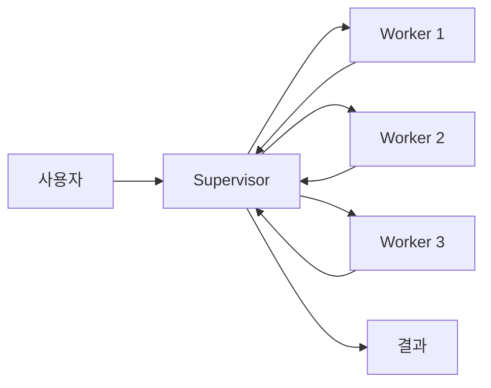

---

## Single Agent vs Multi-Agent

| 구분 | Single Agent | Multi-Agent |
|------|--------------|-------------|
| 구조 | 하나의 LLM | 여러 LLM 협력 |
| 복잡도 | 낮음 | 높음 |
| 전문성 | 범용 | 역할별 특화 |
| 확장성 | 제한적 | 유연함 |
| 비용 | 낮음 | 높음 |

**Multi-Agent가 적합한 경우**:
- 여러 전문 영역이 필요한 태스크
- 검토/개선이 필요한 출력물
- 병렬 처리로 속도 향상 가능

---

## 기본 패턴

### Supervisor-Worker

Supervisor가 작업을 분배하고 Worker들이 실행한다.

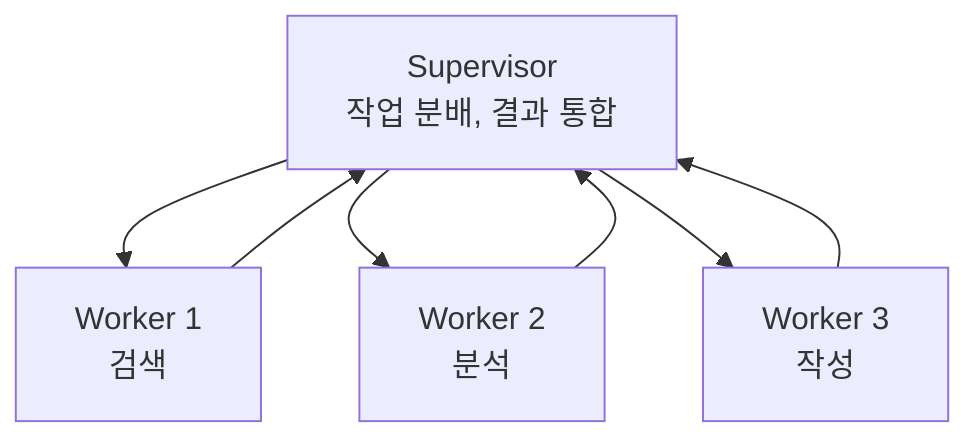

**Supervisor 역할**:
- 태스크 분해
- 적절한 Worker 선택
- 결과 통합 및 품질 확인

**Worker 역할**:
- 특정 태스크 전문 수행
- 결과 반환

### Hierarchical (계층적)

여러 레벨의 Supervisor가 존재한다.

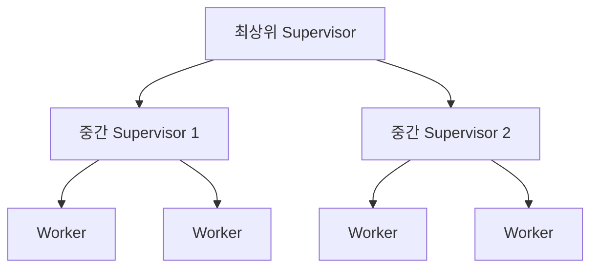

복잡한 조직 구조나 대규모 태스크에 적합하다.

### Peer-to-Peer

Agent들이 동등하게 협력한다.

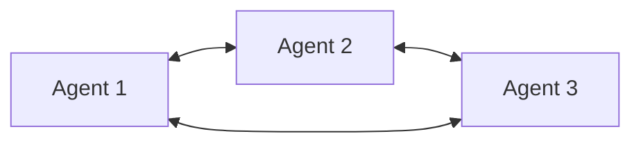

---

## 품질 향상 패턴

### Reflection

Agent가 자신의 출력을 검토하고 개선한다.

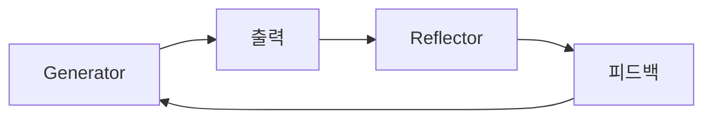

```
Generator: 코드 작성
Reflector: "이 코드에 에러 처리가 없다. 예외 상황을 처리해야 한다."
Generator: 에러 처리 추가하여 재작성
```

### Self-Critique

같은 Agent가 생성과 비평을 번갈아 수행한다.

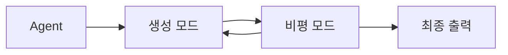

Reflection과 유사하지만 단일 Agent 내에서 수행한다.

### Debate

여러 Agent가 토론하여 최선의 답을 도출한다.

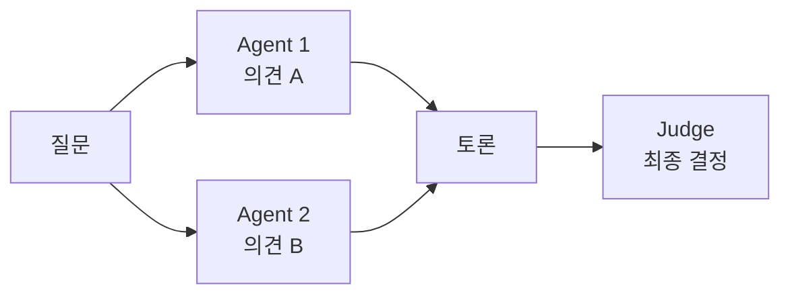

| 단계 | 설명 |
|------|------|
| 1. 개별 응답 | 각 Agent가 독립적으로 답변 |
| 2. 토론 | 서로의 의견 비평 |
| 3. 판정 | Judge가 최종 결론 |

복잡한 판단이 필요한 경우 다양한 관점을 반영한다.

---

## Role-based Agent

각 Agent에 특정 역할(페르소나)을 부여한다.

### 역할 예시

| 역할 | 전문 영역 |
|------|-----------|
| Researcher | 정보 검색, 조사 |
| Coder | 코드 작성 |
| Reviewer | 코드 리뷰, 품질 검토 |
| Writer | 문서 작성 |
| Critic | 비평, 개선점 제안 |

### 소프트웨어 개발 예시

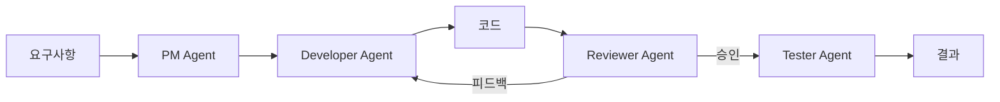

---

## Agent Orchestration

여러 Agent의 실행 흐름을 관리한다.

### 순차 실행

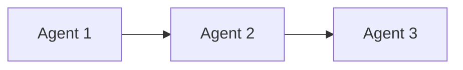

이전 Agent 결과가 다음 Agent 입력이 된다.

### 병렬 실행

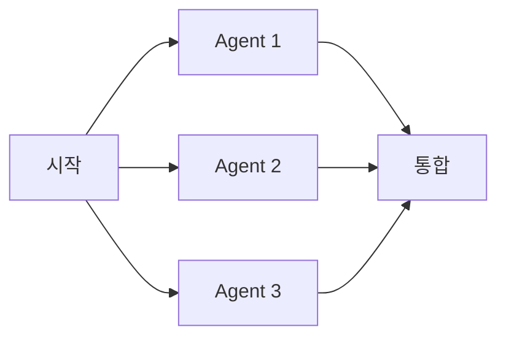

독립적인 태스크를 동시 처리하여 속도를 높인다.

### 조건부 분기

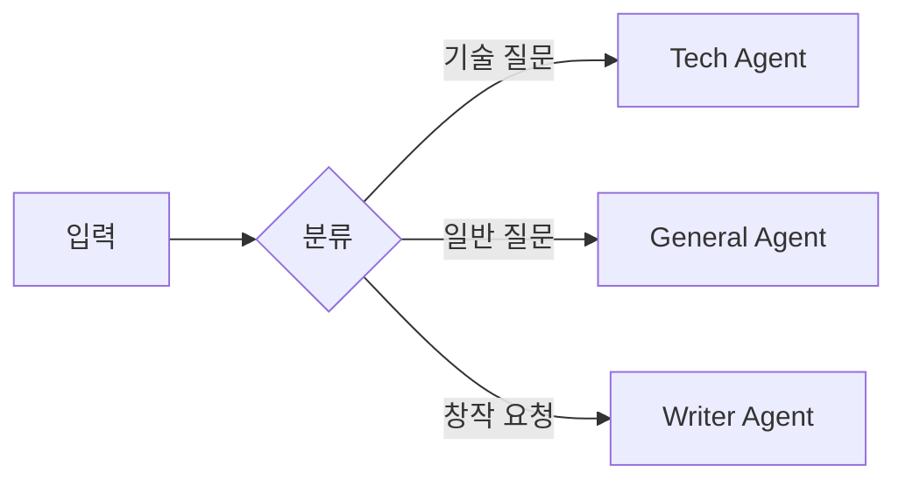

입력에 따라 적절한 Agent로 라우팅한다.

---

## 통신 방식

### 직접 통신

Agent끼리 메시지를 직접 주고받는다.

### 공유 메모리

중앙 메모리에 상태를 저장하고 읽는다.

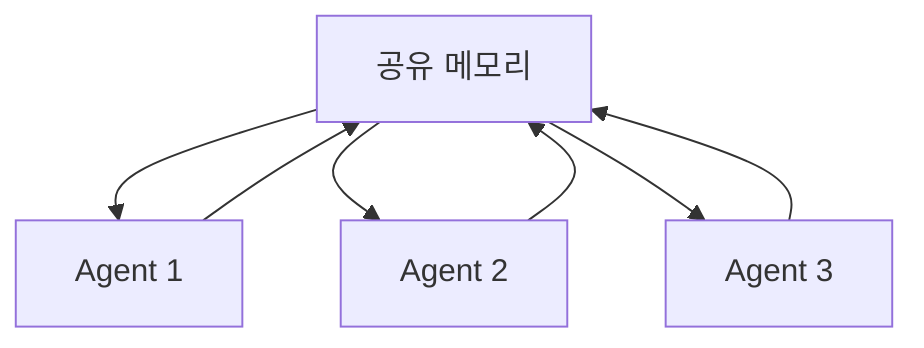

### 메시지 큐

비동기 메시지로 통신한다.

| 방식 | 장점 | 단점 |
|------|------|------|
| 직접 통신 | 단순 | 결합도 높음 |
| 공유 메모리 | 상태 공유 용이 | 동시성 관리 |
| 메시지 큐 | 비동기, 확장성 | 복잡도 |

---

## 실무 고려사항

### 비용 관리

| 전략 | 설명 |
|------|------|
| Agent 수 최소화 | 필요한 역할만 |
| 작은 모델 활용 | 간단한 판단은 저렴한 모델 |
| 캐싱 | 반복 작업 결과 재사용 |

### 오류 처리

| 상황 | 대응 |
|------|------|
| Agent 실패 | 재시도 또는 대체 Agent |
| 무한 루프 | 최대 반복 제한 |
| 불일치 | Supervisor 중재 |

---

## 정리

| 패턴 | 특징 |
|------|------|
| Supervisor-Worker | 중앙 조정, 분업 |
| Hierarchical | 다단계 관리 |
| Reflection | 자기 검토 |
| Debate | 다관점 토론 |
| Role-based | 역할 전문화 |

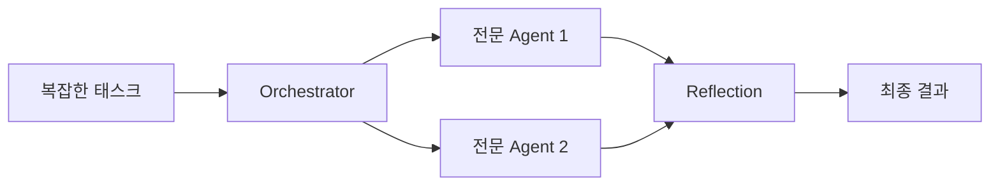

**다음 편**: Tool Calling - Agent가 외부 도구를 호출하는 메커니즘을 다룬다.
